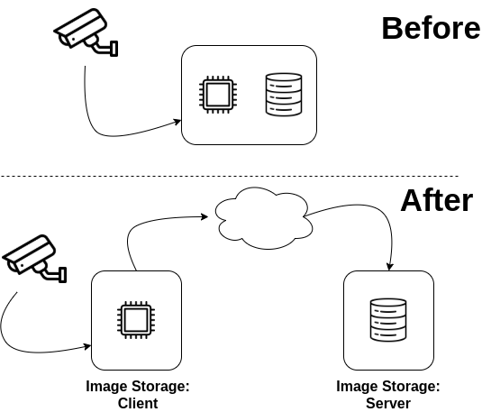

# Image Storage 

Store images on remote machine using HTTP requests.



Icons made by Those Icons and catkuro from 'www.flaticon.com'

## 1. Turning on the server

You need an environment with Python 3.x and packages listed on requirements.txt file. 

1. Clone this project 
```shell
git clone https://github.com/ebsouza/ImageStorage.git
```

2. Enter into project folder
```shell
cd ImageStorage
```

3. Install packages listed on requirements.txt file
```shell
pip install -r requirements.txt
```

4. Run the API
```shell
$ python run.py
```

5. Make suer the server is turned on 
```shell
$ curl http://<host-ip>:5000/
```

'Image Storage API. By: EBSouza' should appear on the screen.


## 2. Test

Run all tests with test.py script.

```shell
$ python test.py
```

## 3. API Reference

#### Create an image

```http
  POST /image
```

```javascript
// payload
{ 
    "ID": <image_id>,
    "image_data": <image.base64>
}
```


#### Get one image

```http
  GET /image/<ID>
```

```javascript
// return
{ 
    "ID": <image_id>,
    "image_data": <image.base64>
}
```

#### Get all images

```http
  GET /image/all
```

```javascript
// return
{ 
    [
        {
            "file_name": "image_example_1",
            "size (Mb)": 1.2
        },
        {
            "file_name": "image_example_2",
            "size (Mb)": 0.8
        }
    ]   
}
```

#### Delete one image

```http
  DELETE /image/<ID>
```

#### Delete all images

```http
  DELETE /image/all
```

#### Recover system info

```http
  GET /info
```

```javascript
// return
{ 
    "number of images": 53,
    "total size (Mb)": 72.7
}
```


## 4. License

MIT


