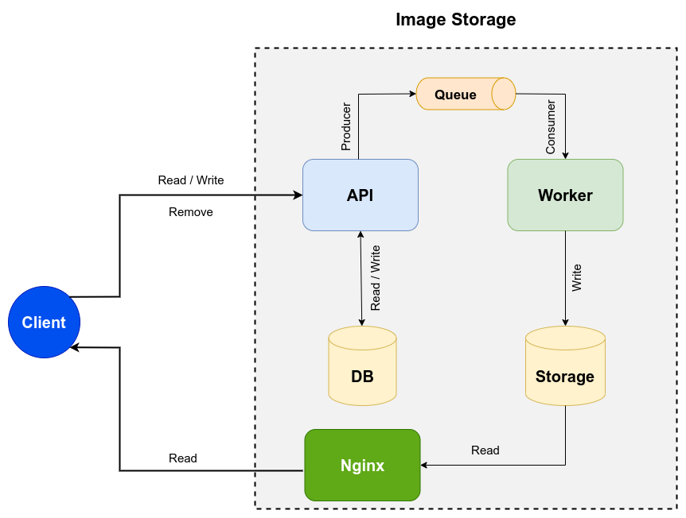

# Image Storage 

Store images on ImageStorage server using HTTP requests.



<center> Figure 1 - Image Storage architecture </center>

---

## 1. Starting Image Storage

First of all install `alembic` on your local or virtual environment.

Set properly all parameters on `settings.toml` and start containers.

```shell
docker-compose up
```

Invoke `alembic migration` tool to development or production environment.

```shell
make run_migration_development
```

## 1.1 Testing

Invoke `alembic migration` tool to test environment.

```shell
make run_migration_test
```

Run tests on api container.

```shell
docker exec -it <api-container> bash -c "python -m pytest --cov=src/image tests/"
```
---

## 2. API Reference

### 2.1. Create image

```http
POST /v1/images
```

```shell
# Post
data=$(base64 "image.jpg")
echo '{"data": "'$data'"}' > payload.json
curl -s -X POST http://localhost:5000/v1/images/ -d @payload.json -H 'Content-Type: application/json'
```

```javascript
// Return
{ 
    "id": <image_id>,
    "path": <image_path>
}
```

### 2.2. Get one image

```http
GET /v1/images/<image_id>
```

```shell
# Get
curl http://localhost:5000/v1/images/<image_id>
```

```javascript
// Return
{ 
  "id": <image_id>,
  "path": <image_path>
}
```

### 2.3. Get many images

```http
GET /v1/images?offset=10&limit=10
```

```shell
# Get
curl http://localhost:5000/v1/images
```

```javascript
// Return
{ 
  "kind": "Collection",
  "next": "<host_url>/images?offset=10&limit=5",
  "previous": "<host_url>/images?offset=5&limit=5",
  "data": [
              {
                  "id": <image_id>,
                  "path": <image_path>
              },
              {
                  "id": <image_id>,
                  "path": <image_path>
              }
    ]
}
```

### 3.3. Delete image

```http
DELETE /v1/images/<image_id>
```

```shell
# DELETE
curl -s -X DELETE http://localhost:5000/v1/images/<image_id>
```

```javascript
// Return
{ 
    "image_id": '<image_id>'
}
```


## 3. License

MIT
